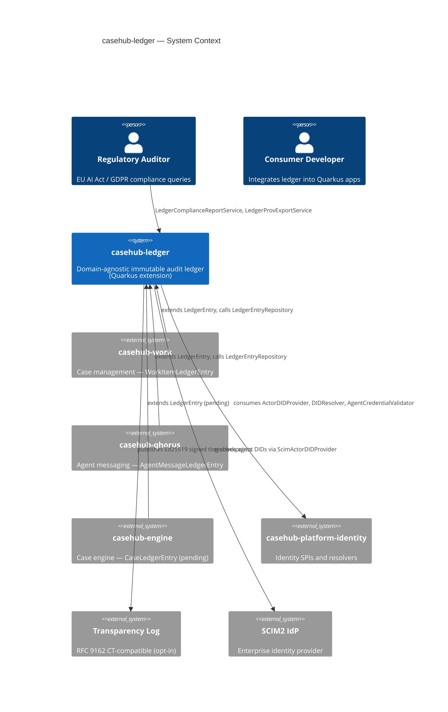
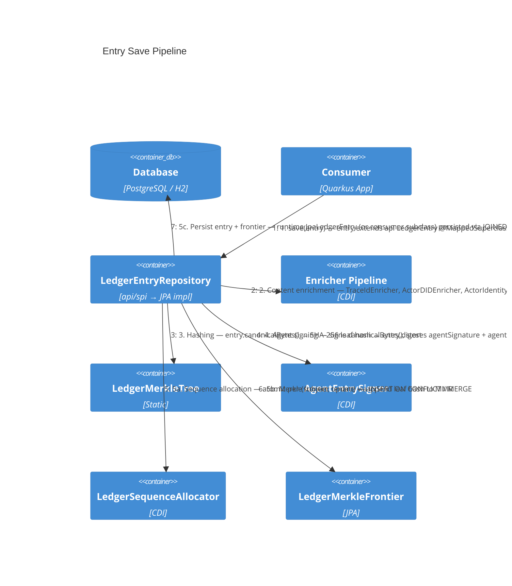

# ARC42STORIES.MD — casehub-ledger

---

## §1 Introduction and Goals

**casehub-ledger** is a domain-agnostic immutable audit ledger delivered as a Quarkus extension. Any Quarkus application adds `io.casehub:casehub-ledger` as a dependency and gets append-only audit logging, Merkle Mountain Range tamper evidence (RFC 9162), peer attestation with Bayesian Beta trust scoring, provenance tracking, and GDPR/EU AI Act compliance infrastructure.

casehub-ledger provides model, SPI, services, and JPA implementations only. REST endpoints and CDI event capture are consumer responsibilities.

### Stakeholders

| Stakeholder | Interest |
|---|---|
| Consumer developers (casehub-work, casehub-qhorus, casehub-engine) | Extension API stability, zero-boilerplate integration, CDI wiring |
| Platform architects | Trust infrastructure for AI agent meshes, federation, identity model |
| Regulatory auditors | EU AI Act Art.12 record-keeping, GDPR Art.22 explainability |
| Data Protection Officers | GDPR Art.17 erasure compliance, pseudonymisation guarantees |

### Quality Goals

| Priority | Goal | Measure |
|---|---|---|
| 1 | Zero-complexity for existing consumers | New capability must not require new config, beans, or boilerplate from consumers who don't use it |
| 2 | Tamper evidence | Any modification to any entry is cryptographically detectable via Merkle MMR with O(log N) inclusion proofs |
| 3 | Regulatory compliance | GDPR Art.17/22 and EU AI Act Art.12 requirements addressed; 6-month minimum retention enforced |
| 4 | Auditability | 7 of 8 axioms from "Creating Characteristically Auditable Agentic AI Systems" (ACM FAIR 2025) fully addressed |

### Artifact Schema

| Artifact type | Format | Example | Where it lives |
|---|---|---|---|
| Issue / work item | `#NNN` | `#156` | GitHub Issues (`casehubio/ledger`) |
| ADR | `ADR-NNNN` | `ADR-0002` | `docs/adr/` |
| Garden entry | `GE-YYYYMMDD-XXXXXX` | `GE-20260618-d244e2` | `~/.hortora/garden/` |
| Protocol | `PP-YYYYMMDD-XXXXXX` | `PP-20260618-51c673` | `docs/protocols/casehub/` |
| Blog entry | `YYYY-MM-DD-slug` | `2026-04-18-mdp03-from-on-to-olog-n` | workspace `blog/` |
| Design spec | `YYYY-MM-DD-topic-design` | `2026-04-18-merkle-tree-upgrade-design` | `docs/specs/` |
| Flyway migration | `VNNNN` | `V1000` | `runtime/src/main/resources/db/ledger/migration/` |

---

## §2 Constraints

### Regulatory

| Constraint | Source | Consequence |
|---|---|---|
| Automatic event recording, tamper-evident logs, 6-month minimum retention, full decision reconstructability | EU AI Act Article 12 | `LedgerRetentionJob`, `LedgerComplianceReportService`, Merkle MMR |
| Explainability of automated decisions — algorithm reference, confidence score, contestation URI | GDPR Article 22 | `ComplianceSupplement` fields |
| Right to erasure — structurally conflicts with immutable logs | GDPR Article 17 | Pseudonymisation with severable token mappings (EDPB Guidelines 05/2019) |
| Enforcement deadline: 2 August 2026; penalties up to EUR 15M or 3% of global turnover | EU AI Act | Compliance infrastructure must be production-ready before deadline |

### Platform

| Constraint | Detail |
|---|---|
| Language / runtime | Java 21 source on Java 26 JVM |
| Framework | Quarkus 3.32.2 |
| Native image | GraalVM 25 |
| Entity model | Plain `@Entity` — no Panache active-record base; allows reactive subclassing by consumers |
| Inheritance | JPA JOINED — `LedgerEntry` is abstract; consumers extend with domain subclasses |
| Multi-tenancy | Explicit `tenancyId` parameter on every tenant-scoped method; unconditional filtering |
| Query declaration | All JPQL uses `@NamedQuery` on entity classes (PP-20260618-51c673) |

### Architectural

| Constraint | Enforcement |
|---|---|
| Blocking/reactive tier separation — blocking beans carry zero reactive imports | `BlockingTierPurityTest`, `BlockingReactiveParityTest` (ArchUnit) |
| Reactive beans excluded at Quarkus augmentation when `casehub.ledger.reactive.enabled=false` | `LedgerProcessor.excludeReactiveBeans()` via `ExcludedTypeBuildItem` |
| Scheduled jobs inject `@CrossTenant CrossTenantLedgerEntryRepository` — direct `EntityManager` prohibited | PP-20260618-51c673 |
| Subclass repositories are read-only — all saves route through `LedgerEntryRepository.save()` | PP-20260616-7d4171 |
| Identity SPIs owned by `casehub-platform-identity` — ledger is a consumer | PP-20260531-dd7062 |

---

## §3 Context and Scope

### System Context

### Consumer Subclasses

| Consumer | Subclass | Subclass table | `subjectId` maps to |
|---|---|---|---|
| casehub-work | `WorkItemLedgerEntry` | `work_item_ledger_entry` | WorkItem UUID |
| casehub-qhorus | `AgentMessageLedgerEntry` | `message_ledger_entry` | Channel UUID |
| casehub-engine (pending) | `CaseLedgerEntry` | `case_ledger_entry` | CaseInstance UUID |

### External Interfaces

| Interface | Protocol | Purpose |
|---|---|---|
| W3C PROV-DM JSON-LD | `LedgerProvExportService` | Standard interchange for regulatory systems, RDF stores, MLOps auditing |
| Ed25519 tlog-checkpoint | `LedgerMerklePublisher` | RFC 9162 signed checkpoints to external transparency logs (opt-in) |
| SCIM2 | `ScimActorDIDProvider` | Enterprise IdP integration for agent DID resolution |
| DID resolution | `KeyDIDResolver`, `WebDIDResolver` | `did:key` (no HTTP) and `did:web` (HTTPS with SSRF protection) |
| Flyway migration path | `classpath:db/ledger/migration` | Consumers must add to `quarkus.flyway.locations` |

---

## §4 Solution Strategy

### Core Architectural Patterns

| Pattern | Why this over alternatives |
|---|---|
| JPA JOINED inheritance for `LedgerEntry` | Consumers add domain fields via subclass join tables without modifying the base schema. Single Table rejected — column explosion across consumers. Table Per Class rejected — no polymorphic queries. |
| Supplement system (optional joined tables) | Avoids wide-table anti-pattern. `ComplianceSupplement` and `ProvenanceSupplement` cost zero when unused. Alternative — columns on base table — forces every consumer to carry compliance fields they may not need. |
| `@Alternative` + `@DefaultBean` layering | No-op defaults satisfy CDI without datasource. Domain-specific implementations displace them. Alternative — `@IfBuildProperty` per consumer — brittle, requires consumer-side exclude lists. |
| Enricher pipeline (`LedgerEntryEnricher` SPI) | Pluggable `@PrePersist` with `@Priority` ordering. Failures logged and swallowed — persist never blocked. Alternative — monolithic `@PrePersist` — not extensible, not orderable. |
| Merkle Mountain Range (stored frontier) | O(log N) storage, immediate inclusion proofs, RFC 9162 compatible. Linear chain rejected — O(N) storage, no proofs. Full tree rejected — ~2N rows, excessive. |
| Bayesian Beta trust scoring | Decay-weighted alpha/beta accumulation. Unattested decisions score 0.5 (unknown), not 1.0 (clean). Forgiveness formula (ADR 0001) rejected — no probabilistic foundation. |

### Layer Taxonomy

| # | Layer | Responsibility |
|---|---|---|
| L1 | Core Entity Model | LedgerEntry, supplements, sequences, repository SPIs, enricher pipeline |
| L2 | Merkle Tamper Evidence | MMR stored frontier, inclusion proofs, verification, Ed25519 checkpoints |
| L3 | Privacy & Compliance | GDPR pseudonymisation, Art.17 erasure, Art.22 supplements, PROV-DM, compliance reports, retention |
| L4 | Trust Scoring | Bayesian Beta, multi-dimensional (capability/dimension/cap×dim), EigenTrust, federation, routing signals |
| L5 | Agent Signing | Bilateral Ed25519, key rotation, SUSPECT detection, AgentSigner SPI |
| L6 | Agent Identity | DID/VC binding, validation pipeline, SCIM integration, platform-identity extraction |
| L7 | Multi-Tenancy | Explicit tenancyId, cross-tenant operations, tenant isolation, build-time guards |
| L8 | Consumer Integration | @DefaultBean no-ops, persistence-memory, PlainLedgerEntry/OutcomeRecorder, reactive tier, deployment module |

### Chapter Sequencing Rationale

- C1 before C2: C1 provides `LedgerEntry` and `digest` field; C2 replaces the digest mechanism with Merkle MMR
- C2 before C7: Merkle frontier structure must exist before multi-dimensional trust can hash attestations
- C4 before C8: privacy pseudonymisation establishes `ActorIdentityProvider` SPI; signing (C8) builds on actor identity
- C7 before C8: multi-dimensional trust scoring (capability/dimension) must be stable before signing adds `capabilityTag`-aware attestation verification
- C8 before C9: bilateral signing introduces `AgentKeyRotatedEvent`; enterprise identity (C9) observes it for cache invalidation
- C10 and C11 independent: consumption APIs (C10) do not require multi-tenancy (C11); minimal delta — C10 adds one layer vs C11's four
- C11 before C12: multi-tenancy (C11) establishes `tenancyId` on all SPIs; consumer compatibility (C12) adds no-op defaults that must accept tenancyId

---

## §5 Building Block View

### Module Structure

| Module | artifactId | Purpose |
|---|---|---|
| `api/` | `casehub-ledger-api` | Model classes (`@MappedSuperclass` entity hierarchy, supplements), enums, SPI interfaces (repositories, appenders, enrichers) — zero framework dependencies |
| `runtime/` | `casehub-ledger` | JPA `@Entity` implementations (`JpaLedgerEntry`, `Jpa*Supplement`), CDI beans, services, Flyway migrations, enricher pipeline |
| `deployment/` | `casehub-ledger-deployment` | Quarkus build-time processors (`@BuildStep`), reactive tier exclusion |
| `persistence-memory/` | `casehub-ledger-memory` | In-memory `@Alternative @Priority(1)` repositories for zero-datasource installs and test isolation |
| `consumer-compat-test/` | (test only) | Boot guard — verifies CDI graph integrity without JPA alternatives selected |

### Layer Architecture

```mermaid
C4Container
    title casehub-ledger — Layer Architecture

    Container_Boundary(l1, "L1: Core Entity Model") {
        Container(entry, "LedgerEntry", "@MappedSuperclass (api)", "Abstract base — subjectId, sequenceNumber, digest, tenancyId, canonicalBytes()")
        Container(jpaentry, "JpaLedgerEntry", "@Entity JOINED (runtime)", "JPA persistence layer extending LedgerEntry")
        Container(attest, "LedgerAttestation", "JPA", "Peer verdict — capabilityTag, trustDimension, dimensionScore")
        Container(supp, "Supplements", "@MappedSuperclass (api) + @Entity (runtime)", "ComplianceSupplement, ProvenanceSupplement — two-tier hierarchy")
        Container(repo, "Repository SPIs", "api/spi", "LedgerEntryRepository, ReactiveLedgerEntryRepository, CrossTenantLedgerEntryRepository")
        Container(appender, "LedgerAppender SPIs", "api/spi", "LedgerAppender, ReactiveLedgerAppender — write-path facade")
        Container(enricher, "Enricher Pipeline", "CDI", "LedgerEntryEnricher with @Priority ordering")
        Container(seqalloc, "LedgerSequenceAllocator", "CDI", "Atomic per-(subject, tenant) sequence allocation")
    }

    Container_Boundary(l2, "L2: Merkle Tamper Evidence") {
        Container(merkle, "LedgerMerkleTree", "Static", "MMR append, treeRoot, inclusionProof, verifyProof")
        Container(frontier, "LedgerMerkleFrontier", "JPA", "Stored frontier — log2(N) rows per subject per tenant")
        Container(verifysvc, "LedgerVerificationService", "CDI", "Inclusion proof generation and verification")
        Container(publisher, "LedgerMerklePublisher", "CDI", "Ed25519 signed tlog-checkpoint (opt-in)")
    }

    Container_Boundary(l3, "L3: Privacy & Compliance") {
        Container(privacy, "ActorIdentityProvider", "SPI (api)", "Tokenise/resolve/erase actor identities")
        Container(erasure, "LedgerErasureService", "CDI", "GDPR Art.17 — severs token-identity mapping")
        Container(erasurerec, "ErasureReceiptLedgerEntry", "JPA", "Tamper-evident erasure record (opt-in)")
        Container(compliance, "LedgerComplianceReportService", "CDI", "Regulatory query — PLAIN_JSON, JSON_LD, CSV")
        Container(prov, "LedgerProvExportService", "CDI", "W3C PROV-DM JSON-LD export")
        Container(retention, "LedgerRetentionJob", "Scheduled", "Daily retention sweep (EU AI Act Art.12)")
    }

    Container_Boundary(l4, "L4: Trust Scoring") {
        Container(trustscore, "ActorTrustScore", "JPA", "Four score types — GLOBAL, CAPABILITY, DIMENSION, CAP×DIM")
        Container(calculator, "TrustScoreCalculator", "CDI", "Pure four-pass computation — no persistence")
        Container(gate, "TrustGateService", "CDI", "Threshold enforcement with capability-then-global fallback")
        Container(aggregator, "AttestationAggregator", "CDI", "Multi-attestor consensus — WEIGHTED_MAJORITY, UNANIMOUS, FIRST")
        Container(eigen, "EigenTrustComputer", "Pure Java", "Power iteration for transitive global trust")
        Container(federation, "Trust Federation", "CDI", "TrustExportService, TrustImportService SPI, TrustBootstrapService")
    }

    Container_Boundary(l5, "L5: Agent Signing") {
        Container(signer, "AgentSigner", "SPI", "sign(actorId, data) → AgentSignature — algorithm-transparent")
        Container(configsigner, "ConfiguredAgentSigner", "CDI @DefaultBean", "Local PEM key pairs per actorId")
        Container(entrysigner, "AgentEntrySigner", "CDI", "Signs canonicalBytes() in save pipeline")
        Container(keyrot, "KeyRotationService", "CDI", "Records rotation, fires AgentKeyRotatedEvent")
        Container(sigverify, "AgentSignatureVerificationService", "CDI", "UNSIGNED, VALID, INVALID, SUSPECT results")
    }

    Container_Boundary(l6, "L6: Agent Identity") {
        Container(didenrich, "ActorDIDEnricher", "CDI @Priority(40)", "Populates actorDid from ActorDIDProvider")
        Container(idvalid, "ActorIdentityValidationEnricher", "CDI @Priority(50)", "Full DID/key/VC validation")
        Container(binding, "ActorIdentityBindingObserver", "CDI", "@ObservesAsync — REQUIRES_NEW persistence")
        Container(enforce, "LedgerIdentityEnforcementListener", "JPA @EntityListeners", "ENFORCE mode gate")
    }

    Container_Boundary(l7, "L7: Multi-Tenancy") {
        Container(crossrepo, "CrossTenantLedgerEntryRepository", "SPI", "Cross-tenant reads — trust, health, retention")
        Container(qualifier, "@CrossTenant", "CDI Qualifier", "Disambiguates tenant-scoped from cross-tenant beans")
    }

    Container_Boundary(l8, "L8: Consumer Integration") {
        Container(noop, "NoOp* Repositories", "CDI @DefaultBean", "CDI-satisfaction no-ops — no datasource required")
        Container(memory, "persistence-memory", "Module", "In-memory @Alternative repositories for testing")
        Container(plain, "PlainLedgerEntry / OutcomeRecorder", "CDI", "Domain-agnostic event writes")
        Container(deploy, "LedgerProcessor", "Deployment @BuildStep", "Feature registration, reactive exclusion, Flyway validation")
    }

    Rel(enricher, merkle, "leafHash after enrichment")
    Rel(enricher, entrysigner, "signs after hash")
    Rel(gate, trustscore, "reads via TrustScoreSource")
    Rel(signer, configsigner, "@DefaultBean")
    Rel(didenrich, entry, "populates actorDid")
    Rel(binding, repo, "saves ActorIdentityBindingEntry via LedgerEntryRepository")
```

---

## §6 Runtime View

### Entry Save Pipeline

Five phases execute in sequence within `LedgerEntryRepository.save()` (JPA implementation). Consumers may also use `LedgerAppender.append(AuditRecord)` as a higher-level write-path facade that constructs `JpaLedgerEntry` from domain-agnostic fields.

**Phase ordering is structural.** Enrichment populates fields that feed `canonicalBytes()` (defined on api `LedgerEntry`). Hashing seals the content. Signing seals the hash. Sequence allocation and Merkle update happen at persist time. The two-tier model (`@MappedSuperclass` in api, `@Entity` in runtime) keeps domain logic framework-free while enabling JPA persistence.

### Trust Score Computation

Two paths — nightly batch and incremental per-attestation:

- **Nightly batch:** `TrustScoreJob` iterates all actors with attestations. Delegates per-actor work to `PerActorTrustComputer` → `TrustScoreCalculator` (four-pass: capability → dimension → cap×dim → global). Optional `EigenTrustComputer` post-pass for transitive trust. Fires `TrustScoreFullPayload` and `TrustScoreDeltaPayload` routing events.
- **Incremental:** `IncrementalTrustUpdateObserver` observes `AttestationRecordedEvent` (`@Observes(AFTER_SUCCESS)`) → `PerActorTrustComputer` in `REQUIRES_NEW` transaction → fires `TrustScoreActorUpdatedEvent`. Gated by `casehub.ledger.trust-score.incremental.enabled`.

### GDPR Art.17 Erasure

`LedgerErasureService.erase(rawActorId, reason)` severs the token-identity mapping in `ActorIdentity`. Ledger entries remain — `actorId` becomes a permanently unresolvable token. Merkle chain stays intact. When `casehub.ledger.erasure-receipt.enabled=true`, writes `ErasureReceiptLedgerEntry` in the same transaction as tamper-evident proof of erasure.

---

## §7 Deployment View

### Quarkus Extension Packaging

| Component | Build-time | Runtime |
|---|---|---|
| `LedgerProcessor` | `@BuildStep`: registers `FeatureBuildItem("ledger")`, excludes reactive beans via `ExcludedTypeBuildItem` when `reactive.enabled=false`, validates Flyway migration location | — |
| `LedgerBuildTimeConfig` | `@ConfigRoot(BUILD_TIME)`: `casehub.ledger.reactive.enabled` (default `false`) | — |
| `LedgerConfig` | — | `@ConfigMapping(prefix = "casehub.ledger")`: retention, trust-score, agent-signing, agent-identity, erasure-receipt config groups |

### Consumer Wiring

| Step | What to do |
|---|---|
| 1. Add dependency | `io.casehub:casehub-ledger` (runtime) in `pom.xml` |
| 2. Add Flyway location | `quarkus.flyway.locations=classpath:db/migration,classpath:db/ledger/migration` |
| 3. Create subclass | Extend `LedgerEntry` with `@Entity` + domain fields; provide subclass Flyway migration |
| 4. Select JPA repositories | `quarkus.arc.selected-alternatives=io.casehub.ledger.runtime.repository.jpa.JpaLedgerEntryRepository,...` |
| 5. (Optional) persistence-memory | Add `io.casehub:casehub-ledger-memory` for zero-datasource installs — in-memory `@Alternative @Priority(1)` repositories auto-activate |

### Database Dialect Support

| Dialect | Detection | Sequence allocation strategy |
|---|---|---|
| PostgreSQL | `getDatabaseProductName() = "PostgreSQL"` | `INSERT ON CONFLICT (subject_id, tenancy_id) DO UPDATE` — atomic, row-lock serialises concurrent writers |
| H2 + MODE=PostgreSQL | `INFORMATION_SCHEMA.SETTINGS` query for `MODE` | `INSERT ON CONFLICT DO NOTHING` + `UPDATE` (H2 2.4.240 rejects `DO UPDATE` with named target) |
| H2 standard | fallback | SQL-standard `MERGE WHEN MATCHED UPDATE WHEN NOT MATCHED INSERT` — not concurrent-safe for first inserts |

---

## §8 Crosscutting Concepts

### Conventions and Protocols

| Concern | Reference | Key rule |
|---|---|---|
| Query declaration | PP-20260618-51c673 `ledger-entry-named-query.md` | All JPQL as `@NamedQuery` on entity classes — Hibernate validates at startup |
| Subclass repository pattern | PP-20260616-7d4171 `ledger-subclass-repo-readonly.md` | Read-only; all saves via `LedgerEntryRepository.save()` for full pipeline |
| Per-subject tenancy | PP-20260616-05dc6a `per-subject-table-tenancy.md` | `tenancy_id` in primary key of all per-subject tables — prevents cross-tenant state corruption |
| Agent identity format | ADR 0004 | `{model-family}:{persona}@{major}` — major version bump resets trust baseline |
| Multi-tenancy | §2 Constraints | Explicit `tenancyId` parameter; `CurrentPrincipal.tenancyId()` never called inside repositories or services |
| CDI event patterns | Sealed interfaces | `LedgerAnomalyDetected` sealed type; plain records, consumers choose `@Observes` vs `@ObservesAsync` |
| Enricher pipeline | ADR 0005 | `LedgerEntryEnricher` SPI with `@Priority` ordering; non-fatal, pluggable |
| Blocking/reactive separation | `LedgerProcessor` | Separate CDI beans; reactive excluded via `ExcludedTypeBuildItem` when disabled |
| Identity SPI ownership | PP-20260531-dd7062 | SPIs in `casehub-platform-identity`; ledger retains enrichers and enforcement |

### Anti-Patterns

- **Wide-table entity**
  - **Symptom:** `LedgerEntry` gains nullable columns that 90% of entries never populate; Hibernate reads/writes widen on every query.
  - **Cause:** Optional data placed directly on the base entity instead of in supplements.
  - **Fix:** Create a `LedgerSupplement` JOINED subclass. Zero storage and query cost when unused.

- **Inline JPQL in services**
  - **Symptom:** `em.createQuery("SELECT e FROM ...")` compiles; fails at runtime in scheduled jobs hours after deployment.
  - **Cause:** Inline JPQL bypasses Hibernate's startup validation. Typos in entity names or field names become delayed runtime errors.
  - **Fix:** Declare as `@NamedQuery` on the entity class. Hibernate validates at boot — typos fail immediately. See PP-20260618-51c673.

- **Save through subclass repository**
  - **Symptom:** New `KeyRotationEntry` persists but has no sequence number, no Merkle leaf, no agent signature.
  - **Cause:** Save bypassed `LedgerEntryRepository.save()` which runs the full pipeline (enrichers → hash → sign → sequence → Merkle).
  - **Fix:** Route all saves through `LedgerEntryRepository.save()`. Subclass repositories (`KeyRotationRepository`, `ActorIdentityBindingRepository`) are read-only. See PP-20260616-7d4171.

- **Mixed blocking/reactive imports**
  - **Symptom:** `BlockingTierPurityTest` fails — reactive `Uni<T>` import found in a blocking service class.
  - **Cause:** Blocking and reactive beans share a CDI context. A blocking bean importing `Uni` pulls the reactive dependency tree into consumers that disabled reactive.
  - **Fix:** Separate blocking and reactive services into distinct CDI beans. Reactive beans excluded at build time via `ExcludedTypeBuildItem` when `casehub.ledger.reactive.enabled=false`.

- **Direct EntityManager in scheduled jobs**
  - **Symptom:** Health job or trust job works on H2 but fails on PostgreSQL with JPQL dialect differences.
  - **Cause:** Inline `em.createQuery()` uses H2-compatible syntax that Hibernate 6 silently accepts on H2 but rejects on PostgreSQL (e.g., `HAVING` with aggregate arithmetic).
  - **Fix:** Inject `@CrossTenant CrossTenantLedgerEntryRepository`. Declare queries as `@NamedQuery` — validated at startup on both dialects. See GE-20260618-d244e2.

- **Missing tenancy_id in per-subject table primary key**
  - **Symptom:** Two tenants with the same deterministic `subjectId` (e.g., `UUID.nameUUIDFromBytes(actorId)`) corrupt each other's Merkle frontier or sequence counter.
  - **Cause:** Table PK uses `(subject_id)` without `tenancy_id`. Deterministic UUID derivation produces identical keys across tenants.
  - **Fix:** Include `tenancy_id` in the composite PK of every per-subject storage table. See PP-20260616-05dc6a.

---

## §9 Journeys and Chapters

### §9.1 Journey Overview

| Journey | Description | Chapters | Status |
|---|---|---|---|
| Tamper-Evident Audit Foundation | Immutable ledger from first entity through Merkle proofs, privacy, and OTel integration | C1–C5 | ✅ Complete |
| Trust and Reputation Infrastructure | Multi-dimensional Bayesian Beta trust scoring with capability, dimension, and federation support | C6–C7 | ✅ Complete |
| Agent Cryptographic Identity | Bilateral signing, key rotation, DID/VC binding, and enterprise identity extraction | C8–C9 | ✅ Complete |
| Production Readiness | Consumption APIs, multi-tenancy, consumer compatibility, and erasure receipts | C10–C12 | ✅ Complete |

```mermaid
flowchart LR
    C1["C1: Immutable Audit Foundation\nL1, L4"] --> C2["C2: Merkle MMR\n+ L2"]
    C2 --> C3["C3: PROV-DM + Reform\nL1, L3"]
    C3 --> C4["C4: Privacy + Identity Model\n+ L3"]
    C4 --> C5["C5: Trust Routing + OTel\nL1, L4"]
    C5 --> C6["C6: Platform + API Split\n+ L8"]
    C6 --> C7["C7: Multi-Dim Trust\nL1, L4, L3"]
    C7 --> C8["C8: Bilateral Signing\n+ L5, L6"]
    C8 --> C9["C9: Enterprise Identity\nL6, L8"]
    C9 --> C10["C10: Consumption APIs\nL1, L4, L8"]
    C10 --> C11["C11: Multi-Tenancy\n+ L7"]
    C11 --> C12["C12: Compat + Erasure\nL1, L3, L8"]

    style C1 fill:#90EE90,color:#000
    style C2 fill:#90EE90,color:#000
    style C3 fill:#90EE90,color:#000
    style C4 fill:#90EE90,color:#000
    style C5 fill:#90EE90,color:#000
    style C6 fill:#90EE90,color:#000
    style C7 fill:#90EE90,color:#000
    style C8 fill:#90EE90,color:#000
    style C9 fill:#90EE90,color:#000
    style C10 fill:#90EE90,color:#000
    style C11 fill:#90EE90,color:#000
    style C12 fill:#90EE90,color:#000
```

### §9.2 Chapter Index

| # | Chapter | Journey | Layers touched | Delta summary | Status |
|---|---|---|---|---|---|
| 1 | Immutable Audit Foundation | Tamper-Evident Audit | L1, L4 | High, Low | ✅ |
| 2 | Merkle Mountain Range | Tamper-Evident Audit | + L2 | High | ✅ |
| 3 | PROV-DM and Entity Model Reform | Tamper-Evident Audit | L1, L3 | Med, Med | ✅ |
| 4 | Privacy and Agent Identity Model | Tamper-Evident Audit | L1, L3 | Low, High | ✅ |
| 5 | Trust Routing and OTel Integration | Tamper-Evident Audit | L1, L4 | Low, Med | ✅ |
| 6 | Platform Integration and API Split | Trust and Reputation | L1, L4, L8 | Med, Med, Low | ✅ |
| 7 | Multi-Dimensional Trust Scoring | Trust and Reputation | L1, L4, L3 | Med, High, Med | ✅ |
| 8 | Bilateral Agent Signing | Agent Cryptographic Identity | L1, L5, L6, L8 | Low, High, Med, Med | ✅ |
| 9 | Enterprise Identity and Platform Extraction | Agent Cryptographic Identity | L6, L8 | High, Med | ✅ |
| 10 | Consumption APIs and Write Safety | Production Readiness | L1, L4, L8 | Med, Med, High | ✅ |
| 11 | Multi-Tenancy | Production Readiness | L1, L2, L4, L7 | Med, Med, Low, High | ✅ |
| 12 | Consumer Compatibility and Erasure | Production Readiness | L1, L3, L8 | Med, Med, High | ✅ |

#### Layer × Chapter Matrix

| Layer | C1 | C2 | C3 | C4 | C5 | C6 | C7 | C8 | C9 | C10 | C11 | C12 |
|---|---|---|---|---|---|---|---|---|---|---|---|---|
| L1 Core Entity Model | High | Med | Med | Low | Low | Med | Med | Low | — | Med | Med | Med |
| L2 Merkle Tamper Evidence | — | High | — | — | — | — | — | — | — | — | Med | — |
| L3 Privacy & Compliance | — | — | Med | High | — | — | Med | — | — | — | — | Med |
| L4 Trust Scoring | Low | — | — | — | Med | Med | High | — | — | Med | Low | — |
| L5 Agent Signing | — | — | — | — | — | — | — | High | — | — | — | — |
| L6 Agent Identity | — | — | — | — | — | — | — | Med | High | — | — | — |
| L7 Multi-Tenancy | — | — | — | — | — | — | — | — | — | — | High | — |
| L8 Consumer Integration | — | — | — | — | — | Low | — | Med | Med | High | — | High |

L1 (Core Entity Model) appears in every column except C9 — the foundational layer bearing cross-cutting responsibility. L2 (Merkle) and L5 (Signing) are focused: introduced once, touched once more, then stable.

#### Sequencing Rationale

- C1 before C2: C1 provides `LedgerEntry.digest`; C2 replaces the digest mechanism with Merkle MMR stored frontier
- C2 before C7: Merkle frontier structure must exist before multi-dimensional trust scoring adds attestation hashing
- C4 before C8: privacy SPI (`ActorIdentityProvider`) establishes actor identity patterns; signing builds on them
- C7 before C8: multi-dimensional trust scores (capabilityTag, dimensionScore) must be stable before signing adds verification
- C8 before C9: `AgentKeyRotatedEvent` (from signing) is observed by enterprise identity for cache invalidation
- C10 and C11 independent: consumption APIs do not require multi-tenancy; minimal delta — C10 adds one layer
- C11 before C12: multi-tenancy establishes tenancyId on all SPIs; consumer compatibility no-ops must accept tenancyId

### §9.3 Chapter Entries

#### Chapter 1 — Immutable Audit Foundation

**Journey:** Tamper-Evident Audit | **Sequence:** 1 of 12 | **Status:** ✅
**Delivered:** 2026-04-15 to 2026-04-17 | **Issues:** pre-issue-tracking (#36 retrospective mapping) | **Blog:** `2026-04-15-mdp01`, `2026-04-17-mdp02`

**What this delivers**
The system can persist append-only audit entries with JPA JOINED inheritance, peer attestations with confidence scores, and initial trust scoring. Entries carry causal chains (`causedByEntryId`), retention archival (EU AI Act Art.12), and a supplement system for optional compliance and provenance data without widening the base table.

**Layer Impact**

| Layer | Delta |
|---|---|
| L1 Core Entity Model | High |
| L4 Trust Scoring | Low |

---

#### Chapter 2 — Merkle Mountain Range

**Journey:** Tamper-Evident Audit | **Sequence:** 2 of 12 | **Status:** ✅
**Delivered:** 2026-04-18 | **Issues:** pre-issue-tracking | **Blog:** `2026-04-18-mdp03-from-on-to-olog-n`

**What this delivers**
Any entry now has an immediate cryptographic inclusion proof (O(log N)) via RFC 9162 Merkle Mountain Range. The stored frontier replaces the linear hash chain — storage drops from O(N) to log₂(N) rows per subject. Ed25519 signed tlog-checkpoints can be published to external transparency logs.

**Layer Impact**

| Layer | Delta |
|---|---|
| L1 Core Entity Model | Med |
| L2 Merkle Tamper Evidence | High |

---

#### Chapter 3 — PROV-DM and Entity Model Reform

**Journey:** Tamper-Evident Audit | **Sequence:** 3 of 12 | **Status:** ✅
**Delivered:** 2026-04-19 to 2026-04-20 | **Issues:** pre-issue-tracking | **Blog:** `2026-04-18-mdp04`, `2026-04-20-mdp06`, `2026-04-20-mdp07`

**What this delivers**
Ledger entries can be exported as W3C PROV-DM JSON-LD for regulatory interchange. All entities are now plain `@Entity` POJOs (Panache removed), enabling reactive subclassing by consumers. Bayesian Beta trust scoring replaces the initial forgiveness formula — unattested decisions score 0.5 (unknown), not 1.0 (clean).

**Layer Impact**

| Layer | Delta |
|---|---|
| L1 Core Entity Model | Med |
| L3 Privacy & Compliance | Med |

---

#### Chapter 4 — Privacy and Agent Identity Model

**Journey:** Tamper-Evident Audit | **Sequence:** 4 of 12 | **Status:** ✅
**Delivered:** 2026-04-21 | **Issues:** #23 | **Blog:** `2026-04-21-mdp08`, `2026-04-21-mdp09`, `2026-04-21-mdp10`

**What this delivers**
GDPR Art.17 erasure works without breaking the Merkle chain — `ActorIdentityProvider` tokenises human actor identities; `LedgerErasureService.erase()` severs the token-identity mapping. EigenTrust power iteration computes transitive global trust across agent meshes. The LLM agent identity model (`{model-family}:{persona}@{major}`) establishes stable trust accumulation across stateless sessions.

**Accountability gaps closed**
- GDPR Art.17 right to erasure → L3 Privacy (pseudonymisation with severable mappings)

**Layer Impact**

| Layer | Delta |
|---|---|
| L1 Core Entity Model | Low |
| L3 Privacy & Compliance | High |

---

#### Chapter 5 — Trust Routing and OTel Integration

**Journey:** Tamper-Evident Audit | **Sequence:** 5 of 12 | **Status:** ✅
**Delivered:** 2026-04-22 to 2026-04-23 | **Issues:** #24, #25, #27, #30, #31 | **Blog:** `2026-04-22-mdp11`, `2026-04-22-mdp12`, `2026-04-23-mdp01`

**What this delivers**
Trust score changes propagate as CDI events with three payload strategies (Full/Delta/ComputedAt) — consumers choose rebuild, incremental cache, or signal-only. `traceId` auto-populates from the active OTel span at persist time via `TraceIdEnricher`. Three new example modules demonstrate privacy pseudonymisation, EigenTrust mesh, and OTel trace wiring.

**Layer Impact**

| Layer | Delta |
|---|---|
| L1 Core Entity Model | Low |
| L4 Trust Scoring | Med |

---

#### Chapter 6 — Platform Integration and API Split

**Journey:** Trust and Reputation | **Sequence:** 6 of 12 | **Status:** ✅
**Delivered:** 2026-04-24 to 2026-04-30 | **Issues:** #67, #68, #73 | **Blog:** `2026-04-24-mdp01`, `2026-04-29-mdp01`

**What this delivers**
The extension splits into `api` (zero-dependency model/SPI) and `runtime` (CDI beans, JPA) modules. `LedgerEntryEnricher` SPI replaces monolithic `@PrePersist`. `DecayFunction` SPI externalises attestation decay weighting. `TrustGateService` provides trust threshold enforcement. The project moves from Tarkus to `io.casehub` groupId under the casehubio GitHub org.

**Layer Impact**

| Layer | Delta |
|---|---|
| L1 Core Entity Model | Med |
| L4 Trust Scoring | Med |
| L8 Consumer Integration | Low |

---

#### Chapter 7 — Multi-Dimensional Trust Scoring

**Journey:** Trust and Reputation | **Sequence:** 7 of 12 | **Status:** ✅
**Delivered:** 2026-05-01 to 2026-05-14 | **Issues:** #55–#65, #76, #78 | **Blog:** `2026-05-01-mdp01`, `2026-05-04-mdp01`, `2026-05-05-mdp01`, `2026-05-05-mdp02`, `2026-05-13-mdp01`, `2026-05-14-mdp01`

**What this delivers**
Trust scoring becomes multi-dimensional: capability-scoped (`capabilityTag`), quality dimensions (`trustDimension` / `dimensionScore`), and composite CAPABILITY_DIMENSION scores. `GlobalScoreStrategy` SPI offers three literature-backed options (Wang & Vassileva, explicit-global, frequency-weighted). Trust federation — `TrustExportService`, `TrustImportService` SPI, `TrustBootstrapService` — enables cross-deployment trust seeding. `LedgerHealthJob` detects sequence gaps; `LedgerComplianceReportService` produces structured regulatory output.

**Layer Impact**

| Layer | Delta |
|---|---|
| L1 Core Entity Model | Med |
| L4 Trust Scoring | High |
| L3 Privacy & Compliance | Med |

---

#### Chapter 8 — Bilateral Agent Signing

**Journey:** Agent Cryptographic Identity | **Sequence:** 8 of 12 | **Status:** ✅
**Delivered:** 2026-05-16 to 2026-05-23 | **Issues:** #79–#97 | **Blog:** `2026-05-17-mdp01`, `2026-05-19-mdp01`, `2026-05-19-mdp02`, `2026-05-21-mdp01` through `2026-05-23-mdp02`

**What this delivers**
Every agent entry can carry a bilateral Ed25519 signature — `AgentSigner` SPI supports local PEM, Vault Transit, and Cloud KMS backends. Key rotation creates immutable `KeyRotationEntry` records in the Merkle chain; compromised keys produce SUSPECT (not INVALID) verification results. DID/VC identity binding validates the actor's cryptographic identity at persist time via a three-SPI pipeline. Reactive service tier separation gates reactive beans at Quarkus build time. `persistence-memory` module provides in-memory alternatives for zero-datasource installs.

**Accountability gaps closed**
- Non-repudiation → L5 Agent Signing (bilateral signatures with per-actor keys)
- Identity binding → L6 Agent Identity (DID/VC validation with ENFORCE mode)

**Layer Impact**

| Layer | Delta |
|---|---|
| L1 Core Entity Model | Low |
| L5 Agent Signing | High |
| L6 Agent Identity | Med |
| L8 Consumer Integration | Med |

---

#### Chapter 9 — Enterprise Identity and Platform Extraction

**Journey:** Agent Cryptographic Identity | **Sequence:** 9 of 12 | **Status:** ✅
**Delivered:** 2026-05-29 to 2026-06-01 | **Issues:** #85, #103, #107, #109, #112, #113 | **Blog:** `2026-05-29-mdp01`, `2026-05-30-mdp01`, `2026-05-31-mdp01`, `2026-06-01-mdp01`

**What this delivers**
`ScimActorDIDProvider` integrates with enterprise SCIM2 identity providers for agent DID resolution. Identity SPIs, resolvers, and no-op defaults extract to `casehub-platform-identity` library — ledger retains enrichers and enforcement. `AgentKeyRotatedEvent` bridges rotation events to platform provider cache invalidation. `ReactiveAgentIdentityVerificationService` wraps the blocking service on a worker pool.

**Layer Impact**

| Layer | Delta |
|---|---|
| L6 Agent Identity | High |
| L8 Consumer Integration | Med |

---

#### Chapter 10 — Consumption APIs and Write Safety

**Journey:** Production Readiness | **Sequence:** 10 of 12 | **Status:** ✅
**Delivered:** 2026-06-02 to 2026-06-08 | **Issues:** #99, #104–#106, #111, #114–#119, #122 | **Blog:** `2026-06-02-mdp01`, `2026-06-03-mdp01`, `2026-06-04-mdp01`, `2026-06-06-mdp01`, `2026-06-08-mdp01`

**What this delivers**
`OutcomeRecorder` + `PlainLedgerEntry` provide a domain-agnostic write API — consumers record outcomes without defining a LedgerEntry subclass. `LedgerSequenceAllocator` delivers atomic per-subject sequence allocation via dialect-aware SQL (INSERT ON CONFLICT / MERGE). Incremental trust recomputation fires per-attestation via CDI observer. `TrustScoreSource` SPI offers three read strategies (Materialized, Cached, Computed). PostgreSQL Testcontainers validates Flyway migrations and concurrent locking against real PostgreSQL.

**Layer Impact**

| Layer | Delta |
|---|---|
| L1 Core Entity Model | Med |
| L4 Trust Scoring | Med |
| L8 Consumer Integration | High |

---

#### Chapter 11 — Multi-Tenancy

**Journey:** Production Readiness | **Sequence:** 11 of 12 | **Status:** ✅
**Delivered:** 2026-06-09 to 2026-06-12 | **Issues:** #124, #125, #127–#132, #135 | **Blog:** `2026-06-09-mdp01`, `2026-06-09-mdp02`, `2026-06-12-mdp01`

**What this delivers**
Every tenant-scoped SPI method takes an explicit `tenancyId` parameter. Cross-tenant operations (trust computation, health checks, retention) use `CrossTenantLedgerEntryRepository` with `@CrossTenant` CDI qualifier and build-time scope validation. Single-tenant deployments use `DEFAULT_TENANT_ID` sentinel — filtering is unconditional, never bypassed. Content-aware Merkle leaf hash via `canonicalBytes()` includes `supplementJson` and subclass `domainContentBytes()` with a build-time guard for `@Entity` subclasses with persistent fields.

**Layer Impact**

| Layer | Delta |
|---|---|
| L1 Core Entity Model | Med |
| L2 Merkle Tamper Evidence | Med |
| L4 Trust Scoring | Low |
| L7 Multi-Tenancy | High |

---

#### Chapter 12 — Consumer Compatibility and Erasure

**Journey:** Production Readiness | **Sequence:** 12 of 12 | **Status:** ✅
**Delivered:** 2026-06-14 to 2026-06-18 | **Issues:** #100, #136, #138–#145, #148, #149, #152–#155 | **Blog:** `2026-06-16-mdp02`, `2026-06-17-mdp01`, `2026-06-17-mdp02`, `2026-06-18-mdp01`, `2026-06-18-mdp02`

**What this delivers**
`@DefaultBean` no-op repositories eliminate consumer CDI exclude-types boilerplate — consumers get a clean CDI graph without selecting JPA alternatives. `consumer-compat-test` module boots without JPA to verify graph integrity. Three-way dialect detection in `LedgerSequenceAllocator` handles PostgreSQL, H2+MODE=PostgreSQL, and H2 standard. `ErasureReceiptLedgerEntry` (V1010) writes a tamper-evident GDPR Art.17 erasure record (opt-in). `LedgerHealthJob` fix removes HAVING arithmetic that Hibernate 6 silently accepts on H2 but rejects on PostgreSQL.

**Accountability gaps closed**
- Tamper-evident erasure proof → L3 Privacy (`ErasureReceiptLedgerEntry` in same TX as token severing)

**Layer Impact**

| Layer | Delta |
|---|---|
| L1 Core Entity Model | Med |
| L3 Privacy & Compliance | Med |
| L8 Consumer Integration | High |

### §9.4 Layer Entries

#### Layer — L1 Core Entity Model

**Participates in chapters:** C1, C2, C3, C4, C5, C6, C7, C8, C10, C11, C12
**Architectural patterns:** JPA JOINED inheritance, Supplement pattern (optional joined tables), Enricher pipeline (Strategy + Chain of Responsibility), Repository SPI with @DefaultBean displacement
**Key protocols:** PP-20260618-51c673 (named-query), PP-20260616-7d4171 (readonly subclass repo), PP-20260616-05dc6a (per-subject tenancy)
**Design refs:** `docs/specs/2026-04-16-ledger-supplement-architecture-design.md`, `docs/specs/2026-04-17-causality-query-api-design.md`, `docs/specs/2026-04-20-remove-panache-from-entities.md`
**Issues:** #23, #67, #68, #73, #116
**Navigation:** `git log --grep="#73" --oneline`
**Completed:** 2026-04-15 (introduced); continuously extended

#### What it adds

**Before:** No audit ledger capability. Consumers must build their own entry model, hashing, sequencing, and persistence.

**After:** `LedgerEntry` abstract base entity with JPA JOINED inheritance provides `subjectId`, `sequenceNumber`, `digest`, `entryType`, `actorId`, `actorType`, `traceId`, `causedByEntryId`, `tenancyId`, and `supplementJson`.

- **Supplement system** — `ComplianceSupplement` and `ProvenanceSupplement` as optional JOINED tables; zero storage cost when unused
- **Enricher pipeline** — `LedgerEntryEnricher` SPI with `@Priority` ordering; failures swallowed, persist never blocked
- **Sequence allocation** — atomic per-(subject, tenant) via `LedgerSequenceAllocator` with three-way SQL dialect detection
- **`canonicalBytes()`** — `public final` method sealing structural encoding; subclasses override `domainContentBytes()` for join-table fields

Not closed here: Merkle tamper evidence (L2), trust scoring (L4), signing (L5), multi-tenancy enforcement (L7).

#### Key files

- `runtime/.../model/LedgerEntry.java` — abstract base entity; JOINED inheritance root; `canonicalBytes()` seals structural encoding
- `runtime/.../model/LedgerAttestation.java` — peer verdict with capabilityTag, trustDimension, dimensionScore, confidence
- `runtime/.../model/supplement/LedgerSupplement.java` — abstract supplement base; JOINED inheritance
- `runtime/.../repository/LedgerEntryRepository.java` — tenant-scoped SPI; `findEntryById` (renamed from `findById` to avoid Panache conflict)
- `runtime/.../repository/CrossTenantLedgerEntryRepository.java` — cross-tenant read operations
- `runtime/.../service/LedgerEntryEnricher.java` — SPI interface for pluggable @PrePersist enrichment
- `runtime/.../service/LedgerTraceListener.java` — `@EntityListeners` runner iterating enricher pipeline
- `runtime/.../repository/jpa/LedgerSequenceAllocator.java` — atomic sequence allocation; three-way Dialect enum (POSTGRESQL / H2_PG_MODE / H2_STANDARD)

#### Key wiring

**`@NamedQuery` on entity classes** — Hibernate validates JPQL at startup. Inline `em.createQuery()` compiles but fails at runtime when scheduled jobs fire hours after deployment. PP-20260618-51c673 mandates this.

**`canonicalBytes()` is `public final`** — subclasses cannot override structural encoding. They override `domainContentBytes()` to include join-table fields. A build-time guard enforces this for `@Entity` subclasses with persistent fields.

**Three-way dialect detection in `LedgerSequenceAllocator`** — `getDatabaseProductName()` returns "H2" for all H2 modes. `getMetaData().getURL()` drops connection properties via Agroal. Detection queries `INFORMATION_SCHEMA.SETTINGS` for `MODE` on H2. PostgreSQL uses single-statement `INSERT ON CONFLICT DO UPDATE` (atomic upsert, row lock serialises). H2+MODE=PostgreSQL uses `INSERT ON CONFLICT DO NOTHING` + `UPDATE` (H2 2.4.240 rejects named-target DO UPDATE). H2 standard uses SQL-standard MERGE.

#### Architectural decisions

**Why plain `@Entity` rather than `PanacheEntityBase`:** Panache active-record forces a specific base class. Consumers extending `LedgerEntry` in reactive contexts (e.g., Qhorus `MessageLedgerEntry`) cannot extend both `PanacheEntityBase` and `LedgerEntry`. Tradeoff: manual `EntityManager` + JPQL instead of Panache convenience methods.

**Why `findEntryById` rather than `findById`:** Java return-type conflict with `PanacheRepositoryBase.findById()` in consumer repos that still use Panache. Renaming avoids the ambiguity at the cost of a non-standard method name.

#### Pattern introduced

JPA JOINED inheritance with supplement system — optional data in secondary join tables, zero cost when unused.

#### Pattern anchor

`LedgerEntry.canonicalBytes()`, `LedgerSupplement`, `LedgerSequenceAllocator.allocateNext()`

#### Gotchas

- **H2 silently accepts HAVING with aggregate arithmetic; PostgreSQL rejects it**
  - **Symptom:** Health job passes all H2 tests; crashes on PostgreSQL with `org.hibernate.exception.SQLGrammarException`.
  - **Cause:** Hibernate 6 translates HAVING clauses differently per dialect. H2 permits `HAVING COUNT(*) != MAX(sequence_number) - MIN(sequence_number) + 1`; PostgreSQL rejects the arithmetic in HAVING context.
  - **Fix:** Move filtering to Java. Query returns `SubjectSequenceStats` via `@NamedQuery`; gap detection runs in `LedgerHealthJob.checkSequenceGaps()`. See GE-20260618-d244e2.

- **H2 2.4.240 rejects `INSERT ON CONFLICT (col) DO UPDATE`**
  - **Symptom:** `LedgerSequenceAllocator` fails on H2 with MODE=PostgreSQL with a parse error on `DO UPDATE SET`.
  - **Cause:** H2's PostgreSQL compatibility mode accepts `ON CONFLICT DO NOTHING` but not `ON CONFLICT (col) DO UPDATE SET`. The named-target syntax is unsupported.
  - **Fix:** Three-way dialect enum. H2+MODE=PostgreSQL uses `INSERT ON CONFLICT DO NOTHING` followed by `UPDATE`. H2 standard uses SQL-standard `MERGE`.

#### Pattern to replicate

1. Define an abstract `@Entity` base class with `@Inheritance(strategy = JOINED)`. Place all tamper-critical fields on the base.
2. Create a `canonicalBytes()` method as `public final` on the base class. Include all structural fields in deterministic byte order.
3. Define a `domainContentBytes()` method (default returns empty byte array). Subclasses override to include join-table fields.
4. Create a `LedgerSupplement` abstract `@Entity` with JOINED inheritance for optional data categories. Each supplement carries only the fields relevant to its concern.
5. Define an `Enricher` SPI interface. CDI discovers all implementations; a `@EntityListeners` class iterates them in `@Priority` order before persist.
6. Implement atomic sequence allocation using dialect-aware SQL. Detect the database product at first use; cache the dialect enum value.

---

#### Layer — L2 Merkle Tamper Evidence

**Participates in chapters:** C2, C11
**Architectural patterns:** Merkle Mountain Range (stored frontier), RFC 9162 Certificate Transparency compatibility
**Key protocols:** —
**Design refs:** `docs/specs/2026-04-18-merkle-tree-upgrade-design.md`, `docs/specs/2026-06-11-merkle-content-integrity-design.md`
**Issues:** #128, #139
**Navigation:** `git log --grep="merkle" --oneline`
**Completed:** 2026-04-18 (introduced); tenancy scoping added C11

#### What it adds

**Before:** Linear hash chain — each entry stores `previousHash`. Storage: O(N). No inclusion proofs. Verification requires reading the entire chain.

**After:** `LedgerMerkleTree` static utility implements RFC 9162 Merkle Mountain Range. `LedgerMerkleFrontier` stores at most log₂(N) rows per subject per tenant.

- **Inclusion proofs** — `inclusionProof(index)` returns a `List<ProofStep>` verifiable against the tree root in O(log N)
- **Signed checkpoints** — `LedgerMerklePublisher` signs the tree root with Ed25519; publishable to external CT-compatible transparency logs
- **Content-aware leaf hash** — `SHA-256(0x00 | canonicalBytes())` covers structural metadata, `supplementJson`, and subclass `domainContentBytes()`

Not closed here: verification does not check agent signatures (L5) or identity bindings (L6).

#### Key files

- `runtime/.../service/LedgerMerkleTree.java` — pure static utility; `append`, `treeRoot`, `inclusionProof`, `verifyProof`; no CDI, no side effects
- `runtime/.../model/LedgerMerkleFrontier.java` — JPA entity storing frontier nodes; composite key `(subject_id, tenancy_id, level)`
- `runtime/.../service/LedgerVerificationService.java` — CDI bean wrapping `LedgerMerkleTree` for treeRoot/inclusionProof/verify
- `runtime/.../service/LedgerMerklePublisher.java` — Ed25519 signed tlog-checkpoint; opt-in CDI bean
- `runtime/.../service/model/InclusionProof.java` — value type carrying the proof path
- `runtime/.../service/model/ProofStep.java` — single sibling node in a proof path

#### Key wiring

**Frontier is per-(subject, tenant)** — the `UNIQUE(subject_id, tenancy_id, level)` constraint ensures one frontier per subject per tenant. Without `tenancy_id` in the key, deterministic `subjectId` derivation produces cross-tenant frontier corruption. Added in C11 (#139).

**`canonicalBytes()` feeds the leaf hash** — `SHA-256(0x00 | canonicalBytes())` per RFC 9162. The `0x00` prefix distinguishes leaf hashes from internal nodes (`0x01`). Subclass `domainContentBytes()` is included — hash-the-content, not just the envelope.

#### Architectural decisions

**Why stored frontier rather than full tree:** Full tree stores ~2N nodes — excessive for audit logs with millions of entries. Stored frontier keeps only the peaks of each complete sub-tree (at most 20 rows at 1M entries). Tradeoff: cannot reconstruct arbitrary historical tree roots without replaying from genesis.

#### Pattern introduced

Merkle Mountain Range with stored frontier — O(log N) storage, immediate inclusion proofs, RFC 9162 compatible.

#### Pattern anchor

`LedgerMerkleTree.append()`, `LedgerMerkleFrontier`

#### Gotchas

- **Frontier corruption from missing tenancy_id**
  - **Symptom:** Merkle verification fails for tenant B after tenant A wrote an entry with the same deterministic `subjectId`.
  - **Cause:** Frontier table PK was `(subject_id, level)` without `tenancy_id`. Two tenants sharing a deterministic subjectId overwrite each other's frontier.
  - **Fix:** Add `tenancy_id` to the frontier table PK. See PP-20260616-05dc6a.

#### Pattern to replicate

1. Implement a static Merkle Mountain Range utility with `append(frontier, leafHash)` → new frontier. No CDI, no side effects.
2. Store the frontier as JPA entities with composite key `(subject_id, tenancy_id, level)`. At most log₂(N) rows per subject.
3. Compute leaf hash as `SHA-256(0x00 | canonicalBytes)`. Use `0x01` prefix for internal nodes.
4. Implement `inclusionProof(index)` returning a list of sibling hashes. Verifier recomputes root from leaf + proof path.
5. (Optional) Sign the tree root with Ed25519 for external transparency log publishing.

---

#### Layer — L3 Privacy & Compliance

**Participates in chapters:** C3, C4, C7, C12
**Architectural patterns:** Pseudonymisation with severable token mappings, Supplement pattern for compliance data, Erasure receipt as LedgerEntry subclass
**Key protocols:** —
**Design refs:** `docs/specs/2026-04-21-privacy-pseudonymisation-design.md`, `docs/specs/2026-04-17-art12-compliance-design.md`, `docs/specs/2026-04-18-prov-dm-export-design.md`, `docs/specs/2026-06-12-system-tokenisation-exempt-design.md`
**Issues:** #23, #100, #130, #142, #152
**Navigation:** `git log --grep="privacy\|erasure\|compliance" --oneline`
**Completed:** 2026-04-18 (PROV-DM); continuously extended through C12

#### What it adds

**Before:** No privacy or compliance infrastructure. Actor identities stored in plain text. No erasure capability. No regulatory reporting.

**After:** `ActorIdentityProvider` SPI tokenises human actor identities. `LedgerErasureService.erase()` severs the token-identity mapping — entries remain, identity becomes permanently unresolvable.

- **Pseudonymisation** — `tokenise(actorId, actorType)` returns a stable token; only HUMAN actors tokenised (AGENT and SYSTEM exempt per C11 #130)
- **GDPR Art.17 erasure** — severs token→identity mapping; Merkle chain intact; optional `ErasureReceiptLedgerEntry` (V1010) in same TX
- **GDPR Art.22 compliance** — `ComplianceSupplement` carries algorithm reference, confidence score, contestation URI, human override availability
- **W3C PROV-DM** — `LedgerProvExportService` maps entries/actors/causality to `prov:Entity`/`Agent`/`Activity` relations
- **Retention** — `LedgerRetentionJob` daily sweep with configurable window; `LedgerEntryArchiver` serialises before deletion
- **Compliance reporting** — `LedgerComplianceReportService` produces `ComplianceReport` with Merkle root anchor (per-actor, per-subject, tenancy-level). `AuditTrailExportService` aggregates entries + Merkle verification + PROV-O export across all subjects in a tenancy. `MerkleVerificationBundleService` generates offline verification packages with embedded Python script. Opt-in `casehub-ledger-reporting` module adds Qute HTML templates, PDF rendering via platform `PdfGenerator`, and content negotiation (`OutputFormat`)

Not closed here: agent identity binding verification (L6), trust scoring for attestation quality (L4).

#### Key files

- `api/.../spi/ActorIdentityProvider.java` — SPI: tokenise/resolve/erase; `tokeniseForQuery()` returns `Optional<String>`
- `runtime/.../privacy/LedgerErasureService.java` — GDPR Art.17 erasure; returns `ErasureResult` with optional receipt entry ID
- `runtime/.../privacy/DecisionContextSanitiser.java` — SPI: sanitise decisionContext JSON before persist
- `runtime/.../model/supplement/ComplianceSupplement.java` — GDPR Art.22 fields
- `runtime/.../model/ErasureReceiptLedgerEntry.java` — tamper-evident erasure record; opt-in via `casehub.ledger.erasure-receipt.enabled`
- `runtime/.../service/LedgerProvExportService.java` — W3C PROV-DM JSON-LD export
- `runtime/.../service/LedgerComplianceReportService.java` — regulatory query producing ComplianceReport
- `runtime/.../service/LedgerRetentionJob.java` — @Scheduled daily retention sweep

#### Key wiring

**`ActorIdentityProvider` moved to `api/spi/`** — initially in runtime; extracted to api module (#142) so consumers can inject it without runtime dependency.

**Non-human exemption** — `tokenise(actorId, ActorType)` takes `ActorType` parameter. Only `HUMAN` actors are pseudonymised. AGENT and SYSTEM actorIds are identity-transparent — tokenising them would break trust scoring, key rotation lookup, and DID resolution. Positive selection (tokenise if HUMAN) rather than negative (skip if not HUMAN).

**`LedgerPrivacyProducer` injects `Instance<EntityManager>`** — not `EntityManager` directly. Datasource-free deployments (persistence-memory) would fail CDI augmentation if `EntityManager` were injected eagerly (#149).

#### Architectural decisions

**Why pseudonymisation rather than encryption:** EDPB Guidelines 05/2019 — pseudonymisation with severable mappings satisfies GDPR Art.17 without breaking the Merkle chain. Encryption would require re-encrypting all entries on key rotation. Tradeoff: if the token mapping is compromised, identities are exposed; severing the mapping is irreversible by design.

#### Pattern introduced

Pseudonymisation with severable token mappings — erasure severs the mapping; entries and Merkle chain remain intact.

#### Pattern anchor

`ActorIdentityProvider.tokenise()`, `LedgerErasureService.erase()`

#### Gotchas

- **Tokenising non-human actors breaks trust scoring**
  - **Symptom:** Trust scores for agent actors drop to 0.5 (unknown) after pseudonymisation is enabled.
  - **Cause:** `tokenise()` was applied to all actor types. Agent actorIds became tokens — trust score lookups, key rotation queries, and DID resolution all use the raw actorId, not the token.
  - **Fix:** Add `ActorType` parameter to `tokenise()`. Only tokenise HUMAN actors. See #130.

#### Pattern to replicate

1. Define an `ActorIdentityProvider` SPI with `tokenise(actorId, actorType)`, `resolve(token)`, and `erase(rawActorId)`.
2. Implement tokenisation as a stable UUID mapping stored in a separate `actor_identity` table. Only tokenise actor types that require privacy protection.
3. Implement `erase()` as a DELETE on the mapping table. The token becomes permanently unresolvable. Entries and Merkle chain remain intact.
4. (Optional) Define an erasure receipt entity as a LedgerEntry subclass. Write it in the same transaction as the mapping deletion for tamper-evident proof.
5. Implement compliance supplements as JOINED entities on the base entry. Carry only the fields required by the specific regulation.

---

#### Layer — L4 Trust Scoring

**Participates in chapters:** C1, C5, C6, C7, C10, C11
**Architectural patterns:** Bayesian Beta distribution, Exponential decay with valence multiplier, SPI Strategy pattern (GlobalScoreStrategy, DecayFunction, TrustScoreSource), CDI event dispatch
**Key protocols:** —
**Design refs:** `docs/specs/2026-04-20-bayesian-trust-design.md`, `docs/specs/2026-05-01-capability-tag-design.md`, `docs/specs/2026-05-02-capability-trust-scores-design.md`, `docs/specs/2026-05-14-capability-dimension-trust-score-design.md`, `docs/specs/2026-05-12-trust-federation-bootstrap-design.md`
**Issues:** #55–#65, #76, #78, #115, #118, #124, #125, #129, #136
**Navigation:** `git log --grep="trust" --oneline`
**Completed:** 2026-04-15 (introduced as forgiveness); evolved through C11

#### What it adds

**Before:** No trust infrastructure. All attestations carry equal weight regardless of recency, capability domain, or quality dimension.

**After:** `ActorTrustScore` entity with four score types via two-column key model (`capability_key`, `dimension_key`). `TrustScoreCalculator` runs a pure four-pass computation (capability → dimension → cap×dim → global).

- **Bayesian Beta** — alpha/beta accumulation with exponential decay (`2^(-age/halfLife)`); FLAGGED decays slower via valence multiplier
- **Multi-dimensional** — `capabilityTag` on attestations scopes trust per capability; `trustDimension`/`dimensionScore` adds continuous quality dimensions; CAPABILITY_DIMENSION composite scores
- **Three global strategies** — `AllAttestationsGlobalStrategy` (default, Wang & Vassileva 2003), `ExplicitGlobalAttestationsStrategy`, `FrequencyWeightedGlobalStrategy`
- **EigenTrust** — opt-in power iteration for transitive trust across agent meshes; applicable when 3+ independent attestors and 10+ distinct actors
- **Federation** — `TrustExportService` read-model, `TrustImportService` SPI (seed-if-absent), `TrustBootstrapService` pre-pass in nightly job
- **Three read strategies** — `MaterializedTrustScoreSource` (DB per call), `CachedTrustScoreSource` (ConcurrentHashMap), `ComputedTrustScoreSource` (on-read from raw attestations)
- **Routing signals** — `TrustScoreFullPayload`, `TrustScoreDeltaPayload`, `TrustScoreComputedAt` CDI events; consumers choose rebuild, incremental cache, or signal-only
- **Incremental path** — `IncrementalTrustUpdateObserver` fires per-attestation via `@Observes(AFTER_SUCCESS)` + `REQUIRES_NEW`

Not closed here: agent identity binding does not affect trust scores directly (L6). Multi-tenancy: trust scores are global, not per-tenant — an actor's trustworthiness does not change between tenants (L7).

#### Key files

- `runtime/.../model/ActorTrustScore.java` — four ScoreType values × two-column key (`capability_key`, `dimension_key`)
- `runtime/.../service/TrustScoreCalculator.java` — pure four-pass computation; no persistence, no CDI events
- `runtime/.../service/TrustGateService.java` — threshold enforcement; capability-then-global fallback; injects `TrustScoreSource`
- `runtime/.../service/AttestationAggregator.java` — multi-attestor consensus (WEIGHTED_MAJORITY, UNANIMOUS_REQUIRED, FIRST_ATTESTOR)
- `runtime/.../service/EigenTrustComputer.java` — power iteration; pure Java, no CDI
- `runtime/.../service/GlobalScoreStrategy.java` — SPI with three `@Alternative` implementations
- `runtime/.../service/DecayFunction.java` — SPI; default `ExponentialDecayFunction` with valence multiplier
- `runtime/.../service/PerActorTrustComputer.java` — delegates to `TrustScoreCalculator`, persists, fires events
- `runtime/.../service/federation/TrustExportService.java` — structured read-model for cross-deployment export

#### Key wiring

**Two-column key replaces `scope_key`** — ADR 0010. `(capability_key, dimension_key)` with CHECK constraint. Four score types fall out from which columns are non-null: GLOBAL (both null), CAPABILITY (cap non-null), DIMENSION (dim non-null), CAPABILITY_DIMENSION (both non-null). `NULLS NOT DISTINCT` on the unique constraint.

**`TrustScoreSource` SPI decouples read from write** — `TrustGateService` injects the SPI, not the repository. Three `@Alternative` implementations: Materialized (DB reads), Cached (ConcurrentHashMap with event-driven refresh), Computed (on-read from raw attestations per actor). Consumers select via `quarkus.arc.selected-alternatives`.

**Global score is cross-tenant** — `ActorTrustScoreRepository` has no `tenancyId` parameter. An actor's trust is based on their behaviour across all tenants. Trust computation uses `CrossTenantLedgerEntryRepository` to read attestations across tenant boundaries.

#### Architectural decisions

**Why Bayesian Beta rather than forgiveness formula (ADR 0003):** Forgiveness (ADR 0001) used recency × frequency — no probabilistic foundation, severity already encoded in `decisionScore`. Bayesian Beta: alpha/beta accumulation with decay, unattested = 0.5 (unknown, not clean). Tradeoff: harder to explain to non-technical stakeholders.

**Why three global strategies rather than one (ADR 0008):** Literature disagrees. Wang & Vassileva 2003 uses all attestations. Fan et al. uses only explicit-global. Frequency-weighted derives from capability scores. Decision: SPI with three `@Alternative` beans. Default is all-attestations (simplest, consistent with root-node model). Tradeoff: configuration burden for consumers.

**Why decay-weighted average for dimensions rather than Bayesian Beta (ADR 0009):** Dimension scores are continuous [0,1] assessments. Beta model is for binary success/failure. Decay-weighted average preserves the continuous signal. Valence asymmetry deliberately suppressed — all dimension attestations pass SOUND to DecayFunction.

#### Pattern introduced

Multi-dimensional Bayesian Beta trust scoring with SPI strategy pattern — four score types, three global strategies, three read strategies.

#### Pattern anchor

`TrustScoreCalculator.compute()`, `ActorTrustScore`, `TrustGateService.meetsThreshold()`

#### Gotchas

- **EigenTrust non-convergence on small graphs**
  - **Symptom:** `EigenTrustComputer` runs maximum iterations without converging; scores oscillate.
  - **Cause:** Graphs with fewer than 10 actors or 3-cycles can produce non-convergent power iteration. The original EigenTrust paper assumes large-scale networks.
  - **Fix:** Gate EigenTrust behind applicability criteria (ADR 0016): 3+ independent attestors, 10+ distinct actors. Default disabled.

#### Pattern to replicate

1. Define a trust score entity with a discriminator model. Use two nullable key columns (`capability_key`, `dimension_key`) with a CHECK constraint — score type is deterministic from key nullity.
2. Implement a pure computation class (no CDI, no persistence) that runs N passes: one per score type in dependency order (capability → dimension → cap×dim → global).
3. Define a `GlobalScoreStrategy` SPI. Provide at least one default implementation as `@DefaultBean`.
4. Define a `TrustScoreSource` SPI to decouple read from write. Implement Materialized (DB), Cached (in-memory with event refresh), and Computed (on-read) strategies as `@Alternative` beans.
5. Wire incremental updates via CDI `@Observes(AFTER_SUCCESS)` on the attestation-recorded event. Run in `REQUIRES_NEW` to avoid the outer transaction's lifecycle.

---

#### Layer — L5 Agent Signing

**Participates in chapters:** C8
**Architectural patterns:** SPI Strategy (AgentSigner), Self-derived key reference, Immutable rotation events as LedgerEntry subclasses
**Key protocols:** PP-20260616-7d4171 (readonly subclass repo for KeyRotationRepository)
**Design refs:** `docs/specs/2026-05-15-bilateral-entry-signing-design.md`, `docs/specs/2026-05-17-key-rotation-design.md`, `docs/specs/2026-05-29-agent-signer-external-key-distribution-design.md`
**Issues:** #79–#88, #93, #94, #97, #104
**Navigation:** `git log --grep="sign\|rotation" --oneline`
**Completed:** 2026-05-23

#### What it adds

**Before:** Entries carry a Merkle digest but no per-actor signature. Any actor with write access can produce entries attributed to any other actor. No non-repudiation.

**After:** `AgentSigner` SPI signs `entry.canonicalBytes()` in the save pipeline. Each entry carries `agentSignature`, `agentPublicKey`, and `agentKeyRef` (Base64URL SHA-256 of public key — self-derived, zero operator config).

- **Algorithm-transparent signing** — algorithm derived from key material, not hardcoded; ML-DSA activates automatically with BouncyCastle ≥ 1.79
- **Key rotation** — `KeyRotationEntry` is a LedgerEntry subclass in the Merkle chain; SCHEDULED vs COMPROMISED (NIST SP 800-57)
- **SUSPECT detection** — cryptographically valid signatures from compromised keys return SUSPECT (not INVALID); `AgentSignatureSuspectEvent` fires via CDI
- **External signing backends** — `AbstractCachingAgentSigner<C>` base for Vault Transit, Cloud KMS, HSMs
- **Compromise is cross-tenant** — `compromisedWindows(actorId, keyRef)` omits tenancyId; a compromised key is a global security signal

Not closed here: DID/VC identity binding (L6) validates *who* the actor is; signing validates *that the actor signed*.

#### Key files

- `api/.../spi/AgentSigner.java` — SPI: `sign(actorId, data)` → `Optional<AgentSignature>`
- `runtime/.../service/ConfiguredAgentSigner.java` — `@DefaultBean`: loads PKCS#8 private + X.509 public PEM per actorId
- `runtime/.../service/AgentEntrySigner.java` — signs `canonicalBytes()` in save pipeline after hash, before persist
- `runtime/.../service/AgentSignatureVerificationService.java` — UNSIGNED / VALID / INVALID / SUSPECT results
- `runtime/.../service/AgentCryptographicVerifier.java` — package-private static utility; shared by blocking and reactive tiers
- `runtime/.../service/KeyRotationService.java` — records rotation, fires `AgentKeyRotatedEvent`
- `runtime/.../model/KeyRotationEntry.java` — LedgerEntry subclass: `previousKeyRef`, `newKeyRef`, `reason`, `effectiveSince`
- `runtime/.../service/model/VerificationResult.java` — enum: UNSIGNED, VALID, INVALID, SUSPECT

#### Key wiring

**`keyRef` is self-derived** — `Base64URL(SHA-256(publicKey))`. Zero operator configuration. Any party with the public key can independently compute the same keyRef. No registry, no coordination.

**Save-pipeline ordering** — `AgentEntrySigner` runs after `canonicalBytes()` hash and before persist. Signing the hash (not the raw fields) ensures the signature covers exactly what the Merkle tree covers.

**SUSPECT vs INVALID** — INVALID means the signature does not verify against the public key (corrupted or forged). SUSPECT means the signature is cryptographically valid but the key was later marked COMPROMISED. The entry is authentic but trustworthiness is in question. Different remediation paths.

#### Architectural decisions

**Why `AgentSigner` rather than `AgentKeyProvider` (ADR 0014):** `AgentKeyProvider` assumed local private key access — breaks for Vault Transit, Cloud KMS, and non-JCA HSMs where the private key never leaves the secure boundary. `AgentSigner.sign(actorId, data)` returns a complete `AgentSignature`. Tradeoff: the SPI is broader (returns signature + public key + keyRef), but supports remote signing without key export.

**Why per-actorId keys rather than per-deployment (ADR 0011):** Per-deployment keys undermine non-repudiation — any actor could have produced any signature. Per-actorId keys prove which specific actor signed. Tradeoff: key management complexity scales with actor count.

#### Pattern introduced

Self-derived keyRef with immutable rotation events — key rotation recorded as LedgerEntry subclass in the Merkle chain; SUSPECT semantics for compromised windows.

#### Pattern anchor

`AgentSigner.sign()`, `KeyRotationEntry`, `AgentCryptographicVerifier.verifyCryptographic()`

#### Gotchas

- **Signing before hashing produces a different signature than expected**
  - **Symptom:** `AgentSignatureVerificationService` returns INVALID for entries that were correctly signed.
  - **Cause:** Save pipeline called `AgentEntrySigner` before computing `canonicalBytes()` hash. The signed data did not match the digest stored on the entry.
  - **Fix:** Pipeline order is structural: enrichment → hash (`canonicalBytes()` → digest) → sign (`canonicalBytes()`) → persist. Sign and hash both use `canonicalBytes()`.

#### Pattern to replicate

1. Define a `Signer` SPI with `sign(actorId, data) → Optional<Signature>`. Return the signature, public key, and a self-derived key reference.
2. Compute `keyRef = Base64URL(SHA-256(publicKey))`. Store on the entry alongside signature and public key.
3. Implement a `@DefaultBean` that loads PEM key pairs from configuration. Implement an `AbstractCachingSigner<C>` for remote backends.
4. Define a `KeyRotationEntry` as an entity subclass. Record `previousKeyRef`, `newKeyRef`, reason (SCHEDULED / COMPROMISED), and `effectiveSince`.
5. Implement SUSPECT semantics: if verification finds a valid signature from a key that was later COMPROMISED, return SUSPECT (not INVALID). Fire a CDI event for consumer response.

---

#### Layer — L6 Agent Identity

**Participates in chapters:** C8, C9
**Architectural patterns:** Three-SPI validation pipeline, CDI event bridge for cross-module cache invalidation, Platform library extraction
**Key protocols:** PP-20260531-dd7062 (identity SPI ownership)
**Design refs:** `docs/specs/2026-05-30-agent-did-vc-identity-binding-design.md`, `docs/specs/2026-05-31-scim-actor-did-provider-design.md`
**Issues:** #81, #103, #107, #109, #112, #113
**Navigation:** `git log --grep="identity\|DID\|SCIM" --oneline`
**Completed:** 2026-06-01

#### What it adds

**Before:** Actors identified by convention string (`actorId`). No cryptographic proof of identity. Trust scoring accumulates against a name that any session can claim.

**After:** `actorDid` field on `LedgerEntry` anchors the actor to a DID document. Three-SPI pipeline validates identity at persist time: `ActorDIDProvider` → `DIDResolver` → `AgentCredentialValidator`.

- **Two-field model** — `actorId` (trust key, convention string) vs `actorDid` (cryptographic anchor, DID)
- **`alsoKnownAs` verification** — `DIDDocument.alsoKnownAs` must include the `actorId` to prevent divergence attacks
- **ActorIdentityBindingEntry** — LedgerEntry subclass recording each binding validation; persisted via `@ObservesAsync` in `REQUIRES_NEW`
- **ENFORCE mode** — `LedgerIdentityEnforcementListener` (`@EntityListeners @PrePersist`) rejects entries with failed identity validation
- **SCIM2 integration** — `ScimActorDIDProvider` resolves agent DIDs from enterprise identity providers; TTL cache with `AgentKeyRotatedEvent`-driven invalidation
- **Platform extraction** — SPIs, resolvers, and no-op defaults extracted to `casehub-platform-identity`; ledger retains enrichers and enforcement

Not closed here: signing (L5) proves the actor signed; identity proves *who* the actor is. These are complementary, not redundant.

#### Key files

- `runtime/.../service/identity/ActorDIDEnricher.java` — `@Priority(40)`: populates `actorDid` from `ActorDIDProvider`; skips `ActorIdentityBindingEntry` (prevents event loop)
- `runtime/.../service/identity/ActorIdentityValidationEnricher.java` — `@Priority(50)`: full DID/key/VC validation; sets `pendingIdentityStatus`
- `runtime/.../service/identity/ActorIdentityBindingObserver.java` — `@ObservesAsync` → `@Transactional(REQUIRES_NEW)` persistence
- `runtime/.../service/identity/LedgerIdentityEnforcementListener.java` — `@EntityListeners @PrePersist`: ENFORCE mode gate
- `runtime/.../service/identity/IdentityCacheInvalidator.java` — bridges `AgentKeyRotatedEvent` → platform provider cache invalidation
- `runtime/.../model/ActorIdentityBindingEntry.java` — LedgerEntry subclass: `boundDid`, `bindingStatus`, `validationDetails`

#### Key wiring

**Enricher ordering via `@Priority`** — `ActorDIDEnricher` at 40 runs before `ActorIdentityValidationEnricher` at 50. DID must be resolved before it can be validated. `TraceIdEnricher` runs at default priority (before both).

**ENFORCE mode uses `@EntityListeners`, not enricher** — enrichers cannot throw (failures swallowed by design). ENFORCE mode must reject invalid entries. Separate `@EntityListeners @PrePersist` callback throws `LedgerIdentityViolationException`.

**Binding persistence via async CDI observer** — `ActorIdentityBindingObserver` uses `@ObservesAsync` + `@Transactional(REQUIRES_NEW)`. Writing the binding entry must not fail the original entry's transaction. The binding entry goes through the full save pipeline (sequence, Merkle, signing).

**`instanceof` guard on `ActorDIDEnricher`** — skips `ActorIdentityBindingEntry` instances to prevent event loop (binding entry triggers enricher which triggers binding observation which triggers another binding entry).

#### Architectural decisions

**Why enricher + `@EntityListeners` rather than enricher-only (ADR 0015 Decision 6):** Enrichers are explicitly non-fatal. Identity enforcement must be fatal. Mixing concerns in one mechanism creates ambiguity about error handling. Tradeoff: two distinct @PrePersist mechanisms on the same entity.

**Why `@ObservesAsync` + `REQUIRES_NEW` for binding persistence (ADR 0015 Decision 7):** The binding entry must not fail the original entry's transaction. `@Observes` in the same TX means a binding save failure rolls back the original entry. `@ObservesAsync` + `REQUIRES_NEW` isolates failures. Tradeoff: binding entry is eventually consistent, not atomic with the original entry.

#### Pattern introduced

Three-SPI identity validation pipeline with `@Priority`-ordered enrichers, separate ENFORCE mode via `@EntityListeners`, and async binding persistence.

#### Pattern anchor

`ActorDIDEnricher`, `ActorIdentityValidationEnricher`, `LedgerIdentityEnforcementListener`

#### Gotchas

- **`ActorDIDEnricher` triggers event loop on `ActorIdentityBindingEntry`**
  - **Symptom:** `StackOverflowError` or infinite loop — binding entry triggers DID enricher which triggers binding observation.
  - **Cause:** `ActorDIDEnricher` populates `actorDid` on all entries including `ActorIdentityBindingEntry`. The binding entry is observed, triggering another binding entry.
  - **Fix:** `instanceof ActorIdentityBindingEntry` guard in `ActorDIDEnricher.enrich()`. Skip binding entries entirely.

#### Pattern to replicate

1. Define a `DIDProvider` SPI that resolves a DID from an actor identifier. Define a `DIDResolver` SPI that fetches and validates the DID document. Define a `CredentialValidator` SPI that validates verifiable credentials.
2. Implement as enrichers with `@Priority` ordering — resolution before validation.
3. Implement ENFORCE mode as a separate `@EntityListeners @PrePersist` callback that throws on invalid identity. Do not mix enforcement with enrichment.
4. Persist binding events via `@ObservesAsync` in `REQUIRES_NEW`. Route through the main entry repository for full save pipeline (sequence, hash, sign, Merkle).
5. Add an `instanceof` guard on the DID enricher to skip binding entry subclasses.

---

#### Layer — L7 Multi-Tenancy

**Participates in chapters:** C11
**Architectural patterns:** Explicit parameter tenancy (not implicit context), Cross-tenant CDI qualifier, Unconditional filtering with sentinel
**Key protocols:** PP-20260616-05dc6a (per-subject table tenancy)
**Design refs:** `docs/specs/issue-127-multi-tenancy/`, `docs/specs/issue-131-tenancy-field-shadowing/`
**Issues:** #127, #128, #129, #131, #132, #135
**Navigation:** `git log --grep="#127\|#131\|tenancy" --oneline`
**Completed:** 2026-06-12

#### What it adds

**Before:** All operations are implicitly single-tenant. No `tenancyId` parameter. A multi-tenant consumer must filter externally.

**After:** Every tenant-scoped SPI method takes an explicit `tenancyId` parameter. Cross-tenant operations use `CrossTenantLedgerEntryRepository` with `@CrossTenant` CDI qualifier.

- **Unconditional filtering** — single-tenant deployments use `TenancyConstants.DEFAULT_TENANT_ID` sentinel. Filtering is never bypassed, never conditional.
- **`CurrentPrincipal.tenancyId()` never called inside repositories or services** — callers pass `tenancyId` from the HTTP boundary. Same pattern as casehub-engine (#299, #405, #406).
- **Build-time scope validation** — `@CrossTenant` qualifier ensures cross-tenant beans are not accidentally injected where tenant-scoped beans are expected.
- **Trust scores are cross-tenant** — `ActorTrustScoreRepository` has no `tenancyId` parameter. An actor's trust is based on behaviour across all tenants.
- **Compromised key lookup is cross-tenant** — a compromised key is a global security signal, not tenant-scoped.

Not closed here: HTTP-boundary tenancy resolution (consumer responsibility), tenant provisioning, tenant-scoped Flyway migrations.

#### Key files

- `runtime/.../qualifier/CrossTenant.java` — CDI qualifier: disambiguates cross-tenant from tenant-scoped repositories
- `runtime/.../repository/CrossTenantLedgerEntryRepository.java` — cross-tenant read SPI
- `runtime/.../repository/jpa/JpaCrossTenantLedgerEntryRepository.java` — JPA implementation with `@NamedQuery` aggregation queries

#### Key wiring

**Explicit parameter, not implicit context** — `CurrentPrincipal.tenancyId()` is never called inside the extension. Callers extract `tenancyId` at the HTTP boundary and pass it as a parameter. This avoids the implicit-context trap where a scheduled job runs without an HTTP context and silently operates on the wrong tenant.

**Sentinel for single-tenant** — `DEFAULT_TENANT_ID = "__default__"`. Unconditional filtering means every query includes `AND tenancy_id = :tenancyId`. Single-tenant deployments pass the sentinel, which always matches. This is simpler and safer than conditional filtering (`if (multiTenant) { addFilter(); }`).

#### Architectural decisions

**Why explicit `tenancyId` parameter rather than `@TenantId` annotation or ThreadLocal context:** Implicit context (ThreadLocal, CDI scope) breaks in async/scheduled/reactive contexts. Explicit parameter is visible in method signatures, never silently wrong, and testable without context setup. Tradeoff: every tenant-scoped method signature carries the parameter — verbose, but unambiguous.

#### Pattern introduced

Explicit parameter tenancy with unconditional sentinel filtering — no implicit context, no conditional branches.

#### Pattern anchor

`LedgerEntryRepository` (all methods take `tenancyId`), `TenancyConstants.DEFAULT_TENANT_ID`

#### Gotchas

- **Hibernate bytecode enhancement redirects `tenancyId` field access in JOINED subclasses**
  - **Symptom:** `LedgerEntry.getTenancyId()` returns null in consumer subclass instances despite the column being populated.
  - **Cause:** Hibernate bytecode enhancement intercepts field access. If a JOINED subclass declares its own `tenancyId` field (shadowing), the enhancement redirects to the subclass field (which is not populated by the base query).
  - **Fix:** Do not declare `tenancyId` on subclasses. Access via the inherited `LedgerEntry.tenancyId` field only. See #131.

#### Pattern to replicate

1. Add a `tenancyId` column to the base entity. Include `tenancy_id` in composite keys of all per-subject tables.
2. Add `String tenancyId` as an explicit parameter to every tenant-scoped SPI method. Do not use ThreadLocal or CDI scope.
3. Define a `CrossTenant` CDI qualifier. Create separate `CrossTenant*Repository` interfaces for operations that read across tenants (trust computation, health checks, retention).
4. Define a `DEFAULT_TENANT_ID` sentinel constant. Apply unconditional filtering — every query includes `AND tenancy_id = :tenancyId`, including single-tenant deployments.
5. Validate at build time that `@CrossTenant`-qualified beans are not injected where tenant-scoped beans are expected.

---

#### Layer — L8 Consumer Integration

**Participates in chapters:** C6, C8, C9, C10, C12
**Architectural patterns:** @DefaultBean displacement, @Alternative @Priority layering, Build-time reactive exclusion, Quarkus deployment processor
**Key protocols:** —
**Design refs:** `docs/specs/2026-05-23-persistence-memory-design.md`, `docs/specs/2026-06-14-noop-defaultbean-repositories-design.md`, `docs/specs/2026-05-19-reactive-service-tier-separation-design.md`
**Issues:** #73, #91, #114, #138, #143, #149
**Navigation:** `git log --grep="consumer\|DefaultBean\|persistence-memory" --oneline`
**Completed:** 2026-06-02 (introduced); continuously extended through C12

#### What it adds

**Before:** Consumers must select JPA alternatives, configure exclude-types for unused reactive beans, and provide a datasource even when not using JPA persistence.

**After:** Zero-config consumer experience. `@DefaultBean` no-op repositories satisfy CDI without datasource. `persistence-memory` module provides full in-memory alternatives for testing. `PlainLedgerEntry`/`OutcomeRecorder` enable domain-agnostic writes. Reactive beans excluded at build time when disabled.

- **No-op defaults** — `NoOpLedgerEntryRepository`, `NoOpActorTrustScoreRepository`, `NoOpLedgerMerkleFrontierRepository`, `NoOpActorIdentityBindingRepository`, `NoOpErasureReceiptRepository` — all `@DefaultBean`; displaced by JPA or memory alternatives
- **persistence-memory** — `@Alternative @Priority(1)` in-memory implementations; `InMemoryAgentSigner` with `register(actorId, keyPair)` for test key management
- **PlainLedgerEntry / OutcomeRecorder** — domain-agnostic concrete subclass + write API; consumers record outcomes without defining a LedgerEntry subclass
- **Reactive tier exclusion** — `LedgerProcessor.excludeReactiveBeans()` emits `ExcludedTypeBuildItem` for all reactive service classes when `casehub.ledger.reactive.enabled=false`
- **consumer-compat-test** — module that boots without JPA alternatives selected; verifies CDI graph integrity with only `@DefaultBean` no-ops active

Not closed here: REST endpoints (consumer responsibility), consumer-specific CDI event observers, consumer Flyway migrations.

#### Key files

- `runtime/.../repository/NoOpLedgerEntryRepository.java` — `@DefaultBean`: all reads return empty, save returns argument unchanged
- `persistence-memory/.../InMemoryLedgerEntryRepository.java` — `@Alternative @Priority(1)`: save pipeline mirrors JPA; per-(subject, tenant) locking
- `persistence-memory/.../InMemoryAgentSigner.java` — `@Alternative @Priority(1)`: `register(actorId, keyPair)` + `clear()` for test boundaries
- `runtime/.../model/PlainLedgerEntry.java` — zero-column LedgerEntry subclass for domain-agnostic writes
- `deployment/.../LedgerProcessor.java` — `@BuildStep`: feature registration, reactive exclusion, Flyway location validation

#### Key wiring

**`@DefaultBean` vs `@Alternative` layering** — `@DefaultBean` on no-op repositories means they are always available but displaced by any non-default bean. JPA repositories are `@Alternative` (selected via `quarkus.arc.selected-alternatives`). In-memory repositories are `@Alternative @Priority(1)` (auto-activate by classpath presence). Priority: in-memory > JPA > no-op.

**Reactive exclusion at build time** — `ExcludedTypeBuildItem` removes reactive CDI bean classes entirely during Quarkus augmentation. Consumer apps that set `casehub.ledger.reactive.enabled=false` (default) never see reactive beans in the CDI container — no need for exclude-types configuration.

**`LedgerPrivacyProducer` injects `Instance<EntityManager>`** — not `EntityManager` directly. When only `@DefaultBean` no-ops are active (no datasource), eager `EntityManager` injection fails CDI augmentation. `Instance<>` defers resolution (#149).

#### Architectural decisions

**Why `@DefaultBean` no-ops rather than `@IfBuildProperty` conditional beans:** `@IfBuildProperty` requires the consumer to set a build property to activate no-ops. `@DefaultBean` activates automatically when no alternative is present — zero configuration. Tradeoff: the no-op bean is always registered (marginal CDI overhead), but consumers never need to know it exists.

**Why a separate `consumer-compat-test` module:** The main test suite selects JPA alternatives. CDI graph integrity with only `@DefaultBean` no-ops is a different configuration that must be independently verified. A separate module boots the extension without JPA and fails if any bean cannot be satisfied.

#### Pattern introduced

`@DefaultBean` no-op displacement — no-op implementations satisfy CDI by default; alternatives displace them without consumer configuration.

#### Pattern anchor

`NoOpLedgerEntryRepository`, `LedgerProcessor.excludeReactiveBeans()`, `consumer-compat-test/`

#### Gotchas

- **`EntityManager` injection fails in no-datasource deployments**
  - **Symptom:** CDI augmentation error: `UnsatisfiedResolutionException` for `EntityManager` when only `@DefaultBean` no-ops are active.
  - **Cause:** A CDI producer eagerly injects `EntityManager`. Without a datasource configured, `EntityManager` cannot be satisfied.
  - **Fix:** Inject `Instance<EntityManager>` instead. Resolution is deferred to first use — and no-op repositories never call it. See #149.

---

## §10 Architectural Decisions

Decisions captured inline in §9.4 Layer entries are not repeated here. This section lists only cross-cutting ADRs that span multiple layers.

| ADR | Decision | Layers | Source |
|---|---|---|---|
| ADR 0004 | LLM agent identity: `{model-family}:{persona}@{major}` — major version bump resets trust baseline; no score inheritance API | Identity, Trust, Provenance | `docs/adr/0004-llm-agent-identity-versioned-persona-names.md` |
| ADR 0005 | LedgerEntryEnricher SPI — pluggable `@PrePersist` pipeline; failures logged and swallowed, persist never blocked | Base Model (used by Signing, Identity, Provenance) | `docs/adr/0005-ledger-entry-enricher-spi.md` |
| ADR 0013 | Post-quantum algorithm migration — signing path algorithm-transparent; ML-DSA activates with BouncyCastle ≥ 1.79; transition via key rotation | Signing, Merkle | `docs/adr/0013-post-quantum-algorithm-migration.md` |
| ADR 0015 | Agent DID/VC identity binding — 11 decisions: two-field model, `alsoKnownAs` verification, enricher ordering via `@Priority`, ENFORCE mode via `@EntityListeners`, binding persistence via `@ObservesAsync` + `REQUIRES_NEW` | Identity, Signing, Base Model | `docs/adr/0015-agent-did-vc-identity-binding.md` |

**EC algorithm support (issue #102):** `SignatureAlgorithms.signatureAlgorithm(Key)` maps EC curve parameters to JCA Signature algorithm names (P-256→SHA256withECDSA, P-384→SHA384withECDSA, P-521→SHA512withECDSA). Both `AgentCryptographicVerifier` and `LedgerPemUtil` SUPPORTED_ALGORITHMS lists include `"EC"`. RSA is out of scope — signature algorithms are not deterministic from the key material.

**Cloud KMS signing adapters (issue #102):** Four first-class signing modules under `signing/` — Vault Transit, AWS KMS, GCP Cloud KMS, Azure Key Vault. Two-layer architecture: pure Java signing client (zero framework deps) + Quarkus CDI adapter extending `AbstractCachingAgentSigner`. EC keys only. `AgentSigner.keyMaterial()` default method avoids wasted cloud KMS sign calls in `AgentEntrySigner.prepareKey()`. Azure adapter includes `EcSignatureConverter` for R‖S→DER signature format conversion.

Full ADR catalogue: `docs/adr/INDEX.md` (17 ADRs; 2 superseded).

---

## §11 Quality Requirements

| Quality | Scenario | Measure |
|---|---|---|
| Tamper evidence | Any modification to any persisted entry must be detectable | Merkle MMR inclusion proof verifies in O(log N); Ed25519 signed checkpoints publishable to external CT logs |
| Non-repudiation | Agent entries must carry cryptographic proof of authorship | `AgentSigner` bilateral signing with per-actor keys (Ed25519 local, EC P-256/P-384/P-521 via cloud KMS); SUSPECT semantics for compromised windows; cloud KMS adapters for AWS, GCP, Azure, Vault Transit |
| Regulatory compliance | Regulatory auditor requests decision history for an actor over a time window | `LedgerComplianceReportService.reportForActor()` returns structured `ComplianceReport` with Merkle root anchor; W3C PROV-DM JSON-LD export |
| Privacy | Data subject exercises right to erasure | `LedgerErasureService.erase()` severs token-identity mapping; entries remain, identity permanently unresolvable; optional `ErasureReceiptLedgerEntry` |
| Extensibility | New consumer adds domain-specific fields to the audit log | JPA JOINED subclass + Flyway migration; zero changes to casehub-ledger |
| Zero-complexity | Consumer adds dependency and boots without configuration | `@DefaultBean` no-op repositories satisfy CDI; no datasource required unless JPA selected |
| Multi-tenant isolation | Two tenants with shared actor IDs must not corrupt each other's state | Explicit `tenancyId` on all SPIs; composite PKs include `tenancy_id`; unconditional filtering |

---

## §12 Risks and Technical Debt

### Active Risks

| Risk | Impact | Mitigation |
|---|---|---|
| EU AI Act enforcement deadline (2 August 2026) | Non-compliance penalties up to EUR 15M / 3% turnover | Compliance infrastructure complete; consumer integration testing in progress |
| EigenTrust non-convergence on small graphs | Degenerate trust scores for deployments with < 10 actors | ADR 0016: gated behind applicability criteria, default disabled |
| Anti-gaming gap — Sybil attacks and trust-building-then-exploit | Coordinated malicious agents can accumulate trust then defect | Identity layer (bilateral signing + key rotation + SUSPECT) addresses identity; social gaming remains open |
| H2 dialect divergence from PostgreSQL | Tests pass on H2 but fail on real PostgreSQL | PostgreSQL Testcontainers in CI; three-way dialect detection in LedgerSequenceAllocator |

### Technical Debt

| Item | Layer | Source |
|---|---|---|
| Cloud KMS `AgentSigner` adapters (AWS, GCP, Azure) not implemented | L5 | #102 |
| Reactive service tier code-generation not evaluated | L8 | #96 (wait until service pair count ≥ 5) |
| Artifact trust scoring for content-hashed artifacts not implemented | L4 | #137 (wait for casehub-ops consumer) |
| Stale ADR file: `0016-plain-ledger-entry-generic-concrete-subclass.md` is a duplicate of ADR 0017 | — | File anomaly; ADR INDEX correctly maps 0016 to EigenTrust |
| Delegation chain tracking (`act` claim) for multi-agent orchestration | L1 | IDEAS.md — proposed as `DelegationSupplement` |
| Zero-knowledge compliance proofs (zk-STARK "Proof of Conduct") | L3 | IDEAS.md — high complexity, not urgent for current deployments |

### Layer Churn

L1 (Core Entity Model) is modified by 11 of 12 chapters. This is expected for a foundation layer — it carries the base entity, repository SPIs, and enricher pipeline that every capability extends. No boundary problem: each chapter's L1 delta is Low or Med (schema additions, not restructuring).

---

## §13 Glossary

| Term | Definition |
|---|---|
| `actorId` | Convention string identifying the entity that produced a ledger entry — human username, agent persona name, or system identifier |
| `actorDid` | Decentralized Identifier (DID) anchoring an actor to a cryptographic identity document |
| `capabilityTag` | String scoping an attestation to a specific capability domain; `"*"` sentinel for global (cross-capability) attestations |
| `canonicalBytes()` | Deterministic byte serialisation of all tamper-critical fields on a `LedgerEntry`; input to both leaf hash and agent signature |
| `domainContentBytes()` | Subclass-provided byte serialisation of join-table fields; included in `canonicalBytes()` for content-aware Merkle hashing |
| CompromisedWindow | Time window during which a key marked COMPROMISED was active; signatures from this window return SUSPECT |
| `CrossTenant` | CDI qualifier distinguishing cross-tenant repository beans from tenant-scoped ones |
| `@DefaultBean` | CDI annotation marking a bean as the default; displaced by any `@ApplicationScoped` or `@Alternative` implementation |
| EigenTrust | Power iteration algorithm for transitive global trust scores across agent meshes; opt-in, default disabled |
| `keyRef` | `Base64URL(SHA-256(publicKey))` — self-derived key reference stored on each signed entry; zero operator configuration |
| Merkle Mountain Range | Append-only hash tree using stored frontier (at most log₂(N) rows per subject); provides O(log N) inclusion proofs |
| `sequenceNumber` | Monotonically increasing integer per (subjectId, tenancyId) pair; allocated atomically by `LedgerSequenceAllocator` |
| `subjectId` | UUID identifying the aggregate a ledger entry belongs to; consumers map it to their domain entity (WorkItem, Channel, CaseInstance) |
| Supplement | Optional joined table extending `LedgerEntry` with domain-specific data (`ComplianceSupplement`, `ProvenanceSupplement`); zero cost when unused |
| SUSPECT | Agent signature verification result: cryptographically valid signature from a key later marked COMPROMISED; trustworthiness in question, not forged |
| `tenancyId` | Explicit tenant identifier passed as parameter on all tenant-scoped SPI methods; `DEFAULT_TENANT_ID` sentinel for single-tenant deployments |
| `traceId` | OpenTelemetry trace identifier auto-populated from the active span at persist time via `TraceIdEnricher` |
| TrustScoreSource | SPI decoupling trust score reads from writes; three implementations: Materialized (DB), Cached (in-memory), Computed (on-read) |
